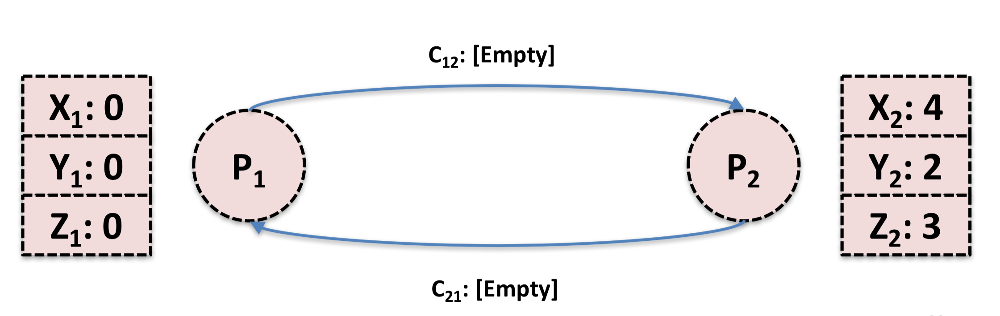
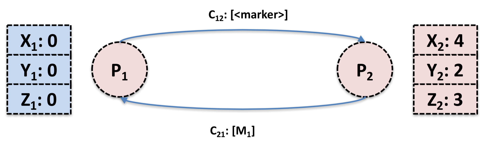
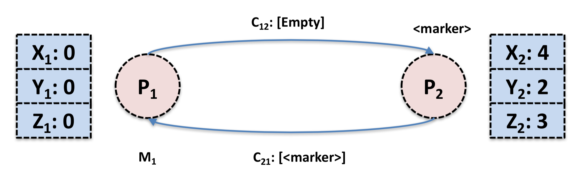
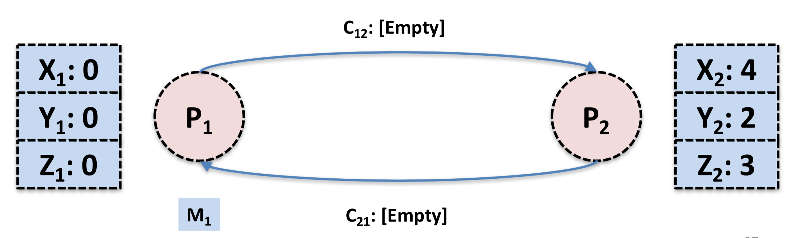

## 分布式快照算法: Chandy-Lamport 

## 0. 引言

上一篇文章最后说到 Spark 的 Structured Streaming 的 Continuous Processing Mode 的容错处理使用了分布式快照（Distributed Snapshot）算法 Chandy-Lamport 算法，那么分布式快照算法可以用来解决什么问题呢？

> A **snapshot algorithm** is used to create a consistent snapshot of the global state of a [distributed system](https://en.wikipedia.org/wiki/Distributed_system). Due to the lack of globally shared memory and a global clock, this isn't trivially possible.

简单来说就是用来在缺乏类似全局时钟或者全局时钟不可靠的分布式系统中来确定一种全局状态。

那么分布式快照算法应用到流式系统中就是确定一个 Global 的 Snapshot，错误处理的时候各个节点根据上一次的 Global Snapshot 来恢复。下面就介绍一下在流式系统中广泛使用分布式快照算法：Chandy-Lamport 算法及其改进算法。Flink 使用的是 Chandy-Lamport 的改进算法。

## 1. Overview

Chandy-Lamport 算法以两个作者的名字命名，没错，其中 Lamport 就是分布式系统领域无人不晓的 Leslie Lamport，著名的一致性算法 Paxos 的作者。算法的论文于 1985 年发表，***Distributed Snapshots: Determining Global States of a Distributed System***，提到这篇论文，不得不提一下这篇论文的由来，洗个澡的时间想出来的。

> The distributed snapshot algorithm described here came about when I visited Chandy, who was then at the University of Texas in Austin.  He posed the problem to me over dinner, but we had both had too much wine to think about it right then.  The next morning, in the shower, I came up with the solution.  When I arrived at Chandy's office, he was waiting for me with the same solution.  I consider the algorithm to be a straightforward application of the basic ideas from [***Time, Clocks and the Ordering of Events in a Distributed System***](http://lamport.azurewebsites.net/pubs/pubs.html#time-clocks). 

正如 Lamport 所述，算法的思想非常的 straightforward，在描述算法之前需要先介绍一下 Global Snapshot。

## 2. Global Snapshot

Global Snapshot 我们也可以理解为 Global State，中文可以叫做全局状态，在系统做 Failure Recovery 的时候非常有用，也是广泛应用在分布式系统，更多是分布式计算系统中的一种容错处理理论基础。

在 Chandy-Lamport 算法中，为了定义分布式系统的全局状态，我们先将分布式系统简化成有限个进程和进程之间的 channel 组成，也就是一个有向图：节点是进程，边是 channel。因为是分布式系统，也就是说，这些进程是运行在不同的物理机器上的。那么一个分布式系统的全局状态就是有进程的状态和 channel 中的 message 组成，这个也是分布式快照算法需要记录的。

因为是有向图，所以每个进程对应着两类 channel: input channel, output channel。同时假设 Channel 是一个容量无限大的 FIFO 队列，收到的 message 都是有序且无重复的。Chandy-Lamport 分布式快照算法通过记录每个进程的 local state 和它的 input channel 中有序的 message，我们可以认为这是一个局部快照。那么全局快照就可以通过将所有的进程的局部快照合并起来得到。

## 3. Chandy-Lamport 算法

那么我们基于上面假设的分布式系统模型来看一下 Chandy-Lamport 算法具体的工作流程是什么样的。主要包括下面三个部分：

* Initiating a snapshot: 也就是开始创建 snapshot，可以由系统中的任意一个进程发起
* Propagating a snapshot: 系统中其他进程开始逐个创建 snapshot 的过程
* Terminating a snapshot: 算法结束条件

***Initiating a snapshot***

* 进程 Pi 发起: 记录自己的进程状态，同时生产一个标识信息 marker，marker 和进程通信的 message 不同
* 将 marker 信息通过 ouput channel 发送给系统里面的其他进程 
* 开始记录所有 input channel 接收到的 message

***Propagating a snapshot***

* 对于进程 Pj 从 input channel Ckj 接收到 marker 信息:
  * 如果 Pj 还没有记录自己的进程状态，则
    * Pj 记录自己的进程状态，同时将 channel Ckj 置为空
    * 向 output channel 发送 marker 信息
    * 记录 input channel Clk (l != k && l != j)收到的所有 msg 
  * 否则
    * 记录在收到 marker 之前的 channel 中收到所有 message

所以这里的 marker 其实是充当一个分隔符，分隔进程做 local snapshot （记录进程状态）的 message。比如 Pj 做完 local snapshot 之后 Ckj 中发送过来的 message 为 [a,b,c,marker,x,y,z] 那么 a, b, c 就是进程 Pk 做 local snapshot 前的数据，Pj 对于这部分数据需要记录下来，比如记录在 log 里面。而 marker 后面 message 正常处理掉就可以了。

***Terminating a snapshot***

* 所有的进程都收到 marker 信息并且记录下自己的状态和 channel 的状态（包含的 message）

## 4. 例子

假设系统中包含两个进程 P1 和 P2 ，P1 进程状态包括三个变量 X1，Y1 和 Z1 , P2 进程包括三个变量 X2，Y2 和 Z2。初始状态如下。

由 P1 发起全局 Snapshot 记录，P1 先记录本身的进程状态，然后向 P2 发送 marker 信息。在 marker 信息到达 P2 之前，P2 向 P1 发送 message: M。

P2 收到 P1 发送过来的 marker 信息之后，记录自己的状态。然后 P1 收到 P2 之前发送过来的 message: M。对于 P1 来说，从 P2 channel 发送过来的信息相当于是 [M, marker]，由于 P1 已经做了 local snapshot，所以 P1 需要记录 message M。

那么全局 Snapshot 就相当于下图中的蓝色部分。

## 5. 总结

Chandy-Lamport 算法通过抽象分布式系统模型描述了一种简单直接但是非常有效的分布式快照算法。讨论 Chandy-Lamport 算法一定要注意算法的几个前提：网络可靠、消息有序。

Spark 的 Structured Streaming 虽然在官方博客中披露使用的 Chandy-Lamport 算法来做 Failover 处理，但是并没有更细节的披露。相比之下 Flink 在 2015 发布了一篇论文 ***Lightweight asynchronous snapshots for distributed dataflows*** 更适合在工程上实现，而且已经应用在了 Flink 项目中。核心思想是在 input source 端插入 barrier 来替代 Chandy-Lamport 算法中的 Marker，通过控制 barrier 的同步来实现 snapshot 的备份和 exactly-once 语义。如果看过 Spark Streaming 那篇论文，对于这个地方很明显的一个疑问就是如何处理 straggler（分布式系统中运行明显慢于其他节点的节点），答案是无法处理。

有时候不得不承认，在大多数情况下，所谓系统架构都是在做 trade-off。

#### Refer

1. Chandy K M, Lamport L. Distributed snapshots: Determining global states of distributed systems[J]. ACM Transactions on Computer Systems (TOCS), 1985, 3(1): 63-75.
2. Carbone P, Fóra G, Ewen S, et al. Lightweight asynchronous snapshots for distributed dataflows[J]. arXiv preprint arXiv:1506.08603, 2015.
3. [Time, Clocks and the Ordering of Events in a Distributed System](http://lamport.azurewebsites.net/pubs/pubs.html#time-clocks)

4. [Leslie Lamport Homepage](http://lamport.azurewebsites.net/pubs/pubs.html#time-clocks)
5. http://tele.informatik.uni-freiburg.de/lehre/ws01/dsys/Lectures/Lecture10.pdf
6. https://people.cs.umass.edu/~arun/590CC/lectures/Snapshots.pdf
7. https://www.cs.princeton.edu/courses/archive/fall16/cos418/docs/P8-chandy-lamport.pdf
8. [简单解释: 分布式快照(Chandy-Lamport算法)](https://zhuanlan.zhihu.com/p/44454670)